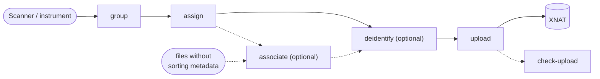

# XNAT Ingest

[](https://github.com/Australian-Imaging-Service/xnat-ingest/actions/workflows/ci-cd.yml)
[](https://codecov.io/gh/Australian-Imaging-Service/xnat-ingest)
[](https://pypi.python.org/pypi/xnat-ingest/)
[](https://australian-imaging-service.github.io/xnat-ingest/)

XNAT-Ingest is a toolkit used for sorting data into project/subject/sessions, de-identifying images before
uploading them to an XNAT instance. Support for various file formats is provided through
the [FileFormats](https://arcanaframework.github.io/fileformats/) package and its extensions
(e.g. [FileFormats MedImage](https://arcanaframework.github.io/fileformats-medimage/), [FileFormats Siemens](https://arcanaframework.github.io/fileformats-vendor-siemens/),...).




## Installation

XNAT ingest can be installed as a Python package from PyPI with `pip`:

```
$ python3 -m pip install xnat-ingest
```

Alternatively, a Docker image containing the toolkit can be pulled from `docker pull ghcr.io/australian-imaging-service/xnat-ingest:latest`

## Running

XNAT Ingest has a public API and a command-line interface (CLI), with sub-commands to group, assign,
associate, de-identify, and upload imaging sessions to XNAT — either as a one-off run or as a
continuously-running service (e.g. via Docker Compose or Kubernetes).

See the [full documentation](https://australian-imaging-service.github.io/xnat-ingest/) for a hands-on
quick start, how-to guides for each part of the pipeline, and the complete CLI/API reference.
